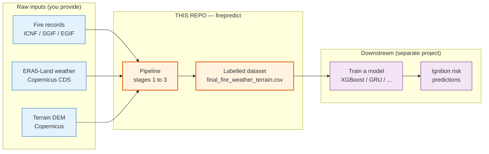
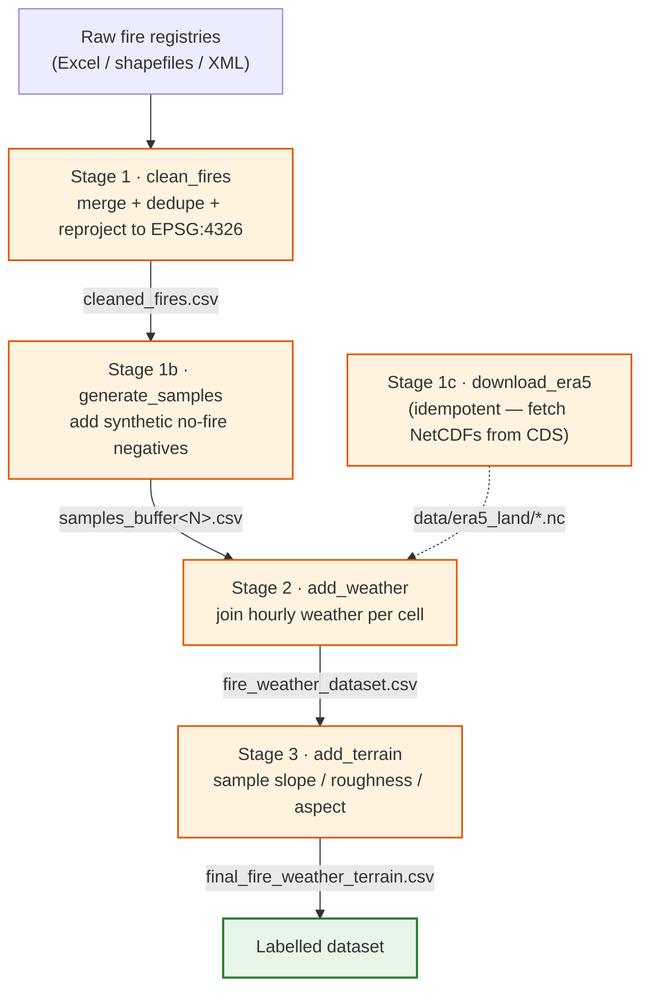

<h1 align="center">Fire-Prediction Dataset Creation</h1>

<p align="center">
  <em>Turn raw fire records, weather reanalysis, and terrain into one clean, labelled
  fire / no-fire table — ready for machine learning.</em>
</p>

<p align="center">
  
  
  
  
</p>

---

## What this is

`firepredict` is a small, region-agnostic **data pipeline**. It answers one question for
every map cell at every hour: *given the weather and the terrain, did a wildfire ignite here?*
To do that it fuses three independent sources into a single labelled table.

| Source | What it provides | Where from |
|---|---|---|
| **Fire records** | when and where fires actually started (the positive labels) | ICNF / SGIF (Portugal), EGIF (Spain) |
| **Weather** | hourly temperature, humidity, wind, precipitation, soil and vegetation state | ERA5-Land reanalysis (Copernicus CDS) |
| **Terrain** | slope, roughness, aspect | Copernicus DEM (30 m downscaled to 10 m) |

Each output row is one **`(location, hour)` sample**, labelled `1` (a real fire ignition) or
`0` (a synthetic non-fire), with the weather and terrain features attached.

> **Scope:** this repository covers **dataset creation only** — it stops at the labelled
> CSV. Training a model on that CSV is a separate concern handled in a different project.

### Where it fits



---

## The pipeline

Five stages run as a **strict linear chain**: each reads the previous stage's CSV from
`outputs/processed/` and writes its own. You can run the whole chain or any single stage, and
because the hand-off is always a CSV on disk you can stop, inspect, or swap a file in between.



| Stage | Module | Does | Output |
|---|---|---|---|
| 1 | `stage1_clean_fires` | Merge fire registries, dedupe by id, reproject to EPSG:4326, derive `lat`/`lon` | `cleaned_fires.csv` |
| 1b | `stage1b_generate_samples` | Snap fires to the ~11 km grid; draw synthetic non-fire negatives (case-control) | `samples_buffer15.csv`, `samples_buffer30.csv` |
| 1c | `stage1c_download_era5` | Download ERA5-Land NetCDFs from Copernicus CDS (idempotent) | `data/era5_land/*.nc` |
| 2 | `stage2_add_weather` | Attach hourly weather (and a lookback time-series) to every sample | `fire_weather_dataset_*.csv` |
| 3 | `stage3_add_terrain` | Sample terrain rasters at each point; encode aspect as sin/cos | `final_fire_weather_terrain_*.csv` |

`stage1c` only fetches weather inputs, so it is shown feeding stage 2 rather than as a link in
the main chain. See [`docs/pipeline.md`](docs/pipeline.md) for the full design of each stage.

---

## Quickstart

```bash
# 1. Clone
git clone https://github.com/PedroMattaMPT/Fire-Prediction-Dataset-Creation.git
cd Fire-Prediction-Dataset-Creation

# 2. Create an environment and install (Python 3.12+)
python -m venv .venv
source .venv/bin/activate
pip install -e .

# 3. Put the raw inputs under data/  (see docs/data-sources.md for every link)

# 4. Build the whole dataset (Portugal is the default region)
python -m firepredict.pipeline

# ...or run one stage at a time (re-run only what changed):
python -m firepredict.pipeline.stage1_clean_fires
python -m firepredict.pipeline.stage1b_generate_samples
python -m firepredict.pipeline.stage2_add_weather
python -m firepredict.pipeline.stage3_add_terrain
```

Run a different region by setting one environment variable:

```bash
FIREPREDICT_REGION=spain python -m firepredict.pipeline
```

> ERA5-Land downloads (stage 1c) need a free Copernicus CDS account and a `~/.cdsapirc`
> file. The multi-gigabyte, multi-year pulls are usually done once and copied into
> `data/era5_land/`. See [`docs/data-sources.md`](docs/data-sources.md) for setup.

---

## Repository layout

```
Fire-Prediction-Dataset-Creation/
├── firepredict/                 # the Python package (dataset-creation code)
│   ├── config.py                # single source of truth: paths, constants, knobs
│   ├── region.py                # RegionSpec registry (Portugal, Spain)
│   ├── sampling.py              # synthetic negative-sample generation
│   ├── rasters.py               # terrain raster sampling
│   ├── weather_era5.py          # ERA5-Land loader (primary weather backend)
│   ├── weather*.py              # legacy Open-Meteo backend (optional)
│   ├── fire_sources/            # pluggable per-country fire adapters
│   │   ├── base.py              #   the FireSourceAdapter contract
│   │   ├── portugal_sgif.py     #   Portugal (SGIF + ICNF)
│   │   └── spain_egif.py        #   Spain (EGIF)
│   └── pipeline/                # the five stages + the all-in-one runner
├── scripts/                     # helper scripts (e.g. partial-year builds)
├── notebooks/                   # a guided walkthrough of stages 1 to 3
├── docs/                        # the guides (data sources, config, schema, ...)
├── data/        (git-ignored)   # raw inputs you provide
└── outputs/     (git-ignored)   # generated CSVs
```

The Python package is named `firepredict` (the broader project's name); this repository
carries only its dataset-creation half.

---

## Regions: any region works

The pipeline is **region-agnostic** — no country is hard-coded. **Any region can be added** by
supplying two things:

1. a **`RegionSpec`** — the region's bounding box, year range, and terrain rasters; and
2. a **fire adapter** (a `FireSourceAdapter`) — a small class that reads that region's fire
   records, in whatever format they come in, into the pipeline's canonical schema.

Register those two and the entire pipeline runs on your data, selected with
`FIREPREDICT_REGION=<your-region>`. The two regions below simply ship as built-in, worked
examples — your own country is added exactly the same way.

| Region | Fire source | Years | Terrain |
|---|---|---|---|
| Portugal (default) | SGIF Excel + ICNF burned-area shapefiles | 2014–2024 | Copernicus DEM (slope/roughness/aspect) |
| Spain | EGIF público XML | 2014–2022 | Copernicus DEM (slope/roughness/aspect) |

See [`docs/adding-a-region.md`](docs/adding-a-region.md) for a step-by-step guide to adding one.

---

## Documentation

Detailed guides live in the [`docs/`](docs/) directory:

- [`data-sources.md`](docs/data-sources.md) — where to download every input, per region, with links
- [`pipeline.md`](docs/pipeline.md) — what each stage does, in depth, with diagrams
- [`configuration.md`](docs/configuration.md) — every `config.py` knob and environment variable
- [`output-schema.md`](docs/output-schema.md) — the columns of the final dataset
- [`adding-a-region.md`](docs/adding-a-region.md) — how to plug in a new country

A runnable walkthrough is in [`notebooks/pipeline_walkthrough.ipynb`](notebooks/pipeline_walkthrough.ipynb).

---

## Star this project

If this is useful to you, please consider leaving a star. It helps others discover the
project and is a real encouragement to keep improving it.

---

## License

MIT — see [LICENSE](LICENSE).
