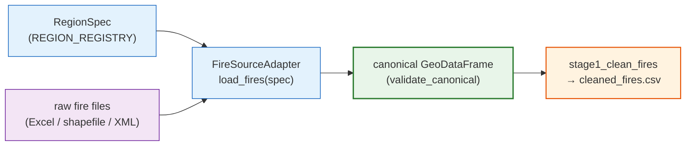

# Adding a region

*Two extension points turn this Portugal-born pipeline into an any-country dataset builder.*

[← README](../README.md) · [Data sources](data-sources.md) · [Pipeline](pipeline.md) · [Configuration](configuration.md) · [Output schema](output-schema.md)

> Everything region-specific lives in one `RegionSpec` entry plus one fire-source adapter. Add both, drop the data into the expected paths, download ERA5-Land for the bbox/years, and run with `FIREPREDICT_REGION=<key>`. No stage code changes.

The pipeline is parameterised by a single `RegionSpec` selected at runtime through the `FIREPREDICT_REGION` environment variable (default `portugal`). `config.py` derives every path, bbox, year, and label from `ACTIVE_SPEC = REGION_REGISTRY[REGION]`. Fire ingestion is pluggable: each region names a `FireSourceAdapter` that reads its raw files and returns one standard table.

So adding a region is two edits to two files:

1. A `RegionSpec` entry in `REGION_REGISTRY` — `firepredict/region.py`.
2. A `FireSourceAdapter` in `firepredict/fire_sources/` that produces the canonical fire schema, wired into `build_fire_adapter`.



The two built-in regions are the two reference implementations: `portugal` (merges two fire sources, stays timezone-naive) and `spain` (a from-scratch XML adapter that localizes to UTC).

---

## 1. The `RegionSpec`

A `RegionSpec` (defined in `firepredict/region.py`) carries every value that varies by region. Add a new entry to `REGION_REGISTRY` keyed by your region's short name (the value you will pass to `FIREPREDICT_REGION`).

| Field | Type | What it is |
| --- | --- | --- |
| `key` | `str` | Region short name. Must equal the registry dict key and the `FIREPREDICT_REGION` value. Used as the ERA5 NetCDF filename prefix and the output-name token. |
| `bbox` | `tuple[float, float, float, float]` | Bounding box as **`(N, W, S, E)`** in EPSG:4326. This order is the CDS/ERA5 convention — not the more common `(min,min,max,max)`. The fire adapter and ERA5 download both read it. |
| `years` | `tuple[int, ...]` | Years to cover, e.g. `tuple(range(2014, 2023))`. Bounds the ERA5 download and the years your fire data should span. |
| `label_year` | `int` | The target year that names the final dataset CSVs (`..._<label_year>_bulk.csv`). |
| `terrain_files` | `dict[str, Path]` | Logical name → raster `Path`. Keys are `"roughness"`, `"slope"`, `"aspect"` (key order preserved). See Terrain below. |
| `fire_source` | `FireSourceConfig` | The pluggable fire-ingestion payload (next table). |
| `era5_request_groups` | `tuple[tuple[str, tuple[str, ...]], ...] \| None` | Optional. How ERA5 variables are split into CDS requests. `None` uses the default `config.ERA5_REQUEST_GROUPS` (3 mixed groups). |
| `era5_months_per_chunk` | `int` | Months per ERA5 download chunk. Default `1`. |

### `FireSourceConfig` fields

`FireSourceConfig` (also in `firepredict/region.py`) is plain data — no behaviour. The adapter named by `adapter` reads its paths, mappings, and labels from here.

| Field | Type | What it is |
| --- | --- | --- |
| `adapter` | `str` | Adapter name resolved by `build_fire_adapter` (e.g. `"portugal_sgif"`, `"egif"`). |
| `column_mapping` | `dict` | Raw source column → canonical column. Used by adapters that rename tabular columns (Portugal). May be `{}` for adapters that build canonical columns directly (Spain). |
| `source_crs` | `int \| None` | CRS of the raw coordinates, or `None` if the adapter derives CRS from the file itself. |
| `source_timezone` | `str \| None` | IANA tz of raw timestamps, or `None` to leave them naive. See the timezone rule below. |
| `positive_cause_labels` | `list` | Cause value(s) treated as the positive class. `config.POSITIVE_CAUSE_LABEL` is `positive_cause_labels[0]`. Portugal: `["Natural"]`; Spain: `[1]`. |
| `fallback_timestamp_columns` | `list[str] \| None` | Columns used to reconstruct a missing start timestamp (Portugal: `["Ano", "Mes", "Dia", "Hora"]`), or `None`. |
| `geometry_source` | `str` | How geometry is derived: `"shapefile_polygon"` (centroid of a polygon) or `"point"` (`Point(lon, lat)`). |
| `target_crs` | `int` | Output CRS. Defaults to `4326` — keep it. |
| `fire_id_column` | `str` | Canonical id column used to dedupe fires. Defaults to `"Cod_SGIF"`. |
| `excel_glob` | `str \| None` | Glob for tabular fire records (Portugal SGIF Excel). |
| `shp_glob` | `str \| None` | Glob for burned-area shapefiles (Portugal ICNF ardida). |
| `records_glob` | `str \| None` | Glob for record files (Spain EGIF XML). |

Set only the input-path fields your adapter uses; leave the rest `None`.

### Terrain rasters

`terrain_files` must supply `roughness`, `slope`, and `aspect` rasters. The original methodology downscales the [Copernicus 30 m DEM](https://portal.opentopography.org/datasetMetadata?otCollectionID=OT.032021.4326.1) to 10 m, so by convention the products are named `Roughness_<region>10.tif`, `Slope_<region>10.tif`, `Aspect_<region>10.tif`. Stage 3 reprojects sample points into each raster's CRS, so the rasters need not share the fire CRS.

### ERA5 request groups (when to override)

ERA5-Land is downloaded one CDS request per *request group* per monthly chunk. The default 3 mixed groups in `config.ERA5_REQUEST_GROUPS` are tuned for the Portugal bbox: CDS rejects requests above ~8 variables/month at that grid size (probed 8 PASS / 9 FAIL).

A larger bbox multiplies the per-request item count and can blow that cap even at the same variable split. Spain's bbox is ~4.5× Portugal's, so its spec sets `era5_request_groups` to 20 single-variable monthly groups (`_SPAIN_ERA5_SINGLE_VAR_GROUPS`) — same 20 variables, split finer to stay under the cost cap. If your bbox is comparable to or smaller than Portugal's, leave `era5_request_groups=None`. If it is much larger, copy the Spain single-variable pattern.

Group names become NetCDF filename suffixes: `<region>_<year>_<chunk:02d>_<group>.nc` (built by `weather_era5._chunk_group_path`; `config.era5_nc_path` builds the un-suffixed `<region>_<year>_<chunk:02d>.nc` form). The variable → unit-conversion is keyed by variable name in `weather_era5`, not by group, so regrouping variables is free.

---

## 2. The `FireSourceAdapter`

An adapter takes one region's raw fire files (in whatever format) and returns the single standard table the rest of the pipeline expects. The contract is a `Protocol` in `firepredict/fire_sources/base.py`:

```python
class FireSourceAdapter(Protocol):
    def load_fires(self, spec: "RegionSpec") -> gpd.GeoDataFrame: ...
```

`stage1_clean_fires` is a thin dispatcher: it calls `build_fire_adapter(ACTIVE_SPEC).load_fires(ACTIVE_SPEC)` and writes the result to `cleaned_fires.csv`. Everything region-specific is inside your adapter.

### The canonical contract

`load_fires` must return an **EPSG:4326** `GeoDataFrame` containing at least `CANONICAL_FIRE_COLUMNS` (extra columns are allowed and should be preserved):

| Canonical column | Meaning |
| --- | --- |
| `Cod_SGIF` | Unique fire id (the default `fire_id_column`). |
| `DH_Inicio` | Fire start datetime. **Must be non-null** for every row. |
| `DH_Fim` | Fire end datetime (may be null). |
| `lat` | Latitude (EPSG:4326). |
| `lon` | Longitude (EPSG:4326). |
| `Causa_Tipo` | Cause value compared against `positive_cause_labels`. |
| `geometry` | Shapely geometry, EPSG:4326. |

Three rules enforce the contract:

- **EPSG:4326.** Reproject right after load; build points as `Point(lon, lat)` with `crs="EPSG:4326"`.
- **`DH_Inicio` non-null.** Drop or reconstruct rows with a missing start time before returning.
- **Dedupe on `spec.fire_source.fire_id_column`.** One row per fire id.

Call `validate_canonical(gdf)` (from `base.py`) before returning. It raises if any required column is missing or if any `DH_Inicio` is null, and otherwise returns the frame unchanged so you can `return validate_canonical(gdf)` inline.

### ⏰ The timezone rule

Timestamp handling is per-region and intentional:

- **Portugal stays naive.** `source_timezone=None`; the adapter applies **no** timezone conversion. The Portugal `cleaned_fires.csv` is reproduced byte-for-byte against the original naive timestamps — do not localize it.
- **Spain localizes `Europe/Madrid` → UTC.** EGIF timestamps are ISO local datetimes with no offset (CET/CEST). The adapter parses them as naive, localizes to `Europe/Madrid`, then converts to UTC, producing tz-aware datetimes. DST edge cases are handled: the repeated autumn hour resolves to the earlier instant (`ambiguous=True`), the spring-forward gap is shifted ahead (`nonexistent="shift_forward"`), so no rows are dropped on transitions.

Pick the rule your source needs. If raw timestamps carry a real timezone, localize and convert to UTC like Spain. Only stay naive when you must match an existing golden output.

### Worked example A — Spain (`spain_egif.py`): from-scratch adapter

`EgifAdapter` builds the canonical frame directly from XML, so its `column_mapping` is `{}`. It is the model for any new region. Its `load_fires` flow:

1. Read `spec.fire_source.records_glob`. `_iter_xml_sources` yields each `.xml` directly and unpacks `.xml` members of any `.zip`.
2. Parse each `<Pif>` element (`_parse_pif`) into a raw record, mapping EGIF tags to canonical columns:
   - `Cod_SGIF` ← `numeroparte`
   - `DH_Inicio` ← `deteccion`, `DH_Fim` ← `extinguido` (fallback `controlado`)
   - `lat`/`lon` ← `latitud`/`longitud`, `Causa_Tipo` ← `idcausa`
   Rows missing `numeroparte`, `deteccion`, or coordinates are skipped.
3. Localize the two datetime columns `Europe/Madrid` → UTC (`_localize_to_utc`).
4. Drop null-`DH_Inicio` rows, then drop coordinates outside `spec.bbox` (remember `(N, W, S, E)`).
5. Dedupe on `Cod_SGIF` (`keep="first"`).
6. Build `Point(lon, lat)` geometry at EPSG:4326, order canonical columns first, and `return validate_canonical(gdf)`.

Note: EGIF stores `Causa_Tipo` as a numeric cause code and applies **no** cause filtering at load time. The expected XML is the **EGIF público** export (Estadística General de Incendios Forestales, Spanish government) — root `<pifs>`, one `<Pif>` per fire, with `pif_comun` / `pif_localizacion` / `pif_tiempos` / `pif_causa` children (see the `spain_egif.py` docstring for the exact tag layout). There is no verified public URL to cite here: obtain the export from the official EGIF público source and confirm the link yourself before documenting it.

### Worked example B — Portugal (`portugal_sgif.py`): merge two sources

`PortugalSgifAdapter` is the original stage-1 logic moved verbatim into an adapter. It merges two fire sources into one canonical frame:

1. `_load_sgif_excels(fs.excel_glob)` — concatenate the SGIF Excel registry files (raw, **unsorted** glob order — preserved for byte-identity).
2. `_load_ardida_shapefiles(fs.shp_glob)` — load ICNF burned-area shapefiles, reproject to EPSG:4326, derive `lat`/`lon` from polygon centroids.
3. `_append_unique_sgif(...)` — rename SGIF columns via `fs.column_mapping`, then append only SGIF fires whose `Cod_SGIF` is not already present (dedupe at merge).
4. `_reconstruct_missing_timestamps(...)` — fill missing `DH_Inicio` from `fs.fallback_timestamp_columns` (`Ano/Mes/Dia/Hora`).
5. Drop rows with null `DH_Inicio` or `Causa_Tipo`; positive cause is `fs.positive_cause_labels[0]` (`"Natural"`).

This is the pattern to follow when a region's fires come from two registries (e.g. a tabular registry plus a burned-area polygon layer): load each, reproject, rename to canonical, and dedupe on the id column when merging.

### Wiring the adapter into the factory

`build_fire_adapter(spec)` in `firepredict/fire_sources/base.py` maps `spec.fire_source.adapter` to a class. Add your branch:

```python
def build_fire_adapter(spec):
    name = spec.fire_source.adapter
    if name == "portugal_sgif":
        from .portugal_sgif import PortugalSgifAdapter
        return PortugalSgifAdapter()
    if name == "egif":
        from .spain_egif import EgifAdapter
        return EgifAdapter()
    if name == "my_region":            # <- your new branch
        from .my_region import MyRegionAdapter
        return MyRegionAdapter()
    raise ValueError(f"Unknown fire-source adapter: {name!r}")
```

Imports are local inside each branch so an unused adapter's dependencies never load.

---

## Checklist

1. **Write the adapter.** Add `firepredict/fire_sources/<region>.py` with a class whose `load_fires(spec)` returns a canonical EPSG:4326 `GeoDataFrame` and ends with `return validate_canonical(gdf)`.
2. **Register the adapter name.** Add a branch for your `adapter` string in `build_fire_adapter` (`firepredict/fire_sources/base.py`).
3. **Add the `RegionSpec`.** Add an entry to `REGION_REGISTRY` in `firepredict/region.py`: `key`, `bbox=(N, W, S, E)`, `years`, `label_year`, `terrain_files`, and a `FireSourceConfig` (set `adapter`, the input glob(s), `positive_cause_labels`, `source_timezone`, `fire_id_column`, `geometry_source`). Override `era5_request_groups` only if your bbox is much larger than Portugal's.
4. **Drop data into the expected paths.** Put fire records where your glob points (e.g. `data/<region>/...`) and the three terrain TIFFs where `terrain_files` points (e.g. `data/<region>/Roughness_<region>10.tif`).
5. **Download ERA5-Land** for your bbox and years into `data/era5_land/`. You need a free [Copernicus CDS](https://cds.climate.copernicus.eu/) account, a `~/.cdsapirc` ([API setup](https://cds.climate.copernicus.eu/how-to-api)), and the [ERA5-Land licence](https://cds.climate.copernicus.eu/datasets/reanalysis-era5-land) accepted. Run the download stage (`python -m firepredict.pipeline.stage1c_download_era5`) or copy NetCDFs produced elsewhere. Files must be named `<region>_<year>_<chunk:02d>_<group>.nc`.
6. **Run the pipeline.** Validate with the new region:

```bash
FIREPREDICT_REGION=<key> python -m firepredict.pipeline
```

Run individual stages the same way (`stage1_clean_fires`, `stage1b_generate_samples`, `stage1c_download_era5`, `stage2_add_weather`, `stage3_add_terrain`) to re-run only what changed. Outputs land under `outputs/processed/` with a `_<key>` token in the filename (Portugal keeps the un-tokenised original names). Model training is **not** part of this repo — it happens in a separate downstream project.

> Weather backend: `config.WEATHER_SOURCE` defaults to `"era5"` (local NetCDFs via `firepredict/weather_era5.py`). The legacy `"open_meteo"` backend (`firepredict/weather.py` + `weather_bulk.py`) hits the [Open-Meteo archive API](https://open-meteo.com/en/docs/historical-weather-api) and is rate-limited on the free tier.

---

**See also:** [Data sources](data-sources.md) · [Configuration](configuration.md) · [Pipeline](pipeline.md)
