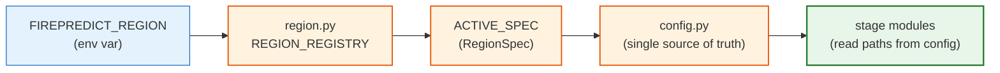

# Configuration

*Every knob in one place — what to set, where it lives, and what it changes.*

[← README](../README.md) · [Data sources](data-sources.md) · [Pipeline](pipeline.md) · [Output schema](output-schema.md) · [Adding a region](adding-a-region.md)

> `firepredict/config.py` is the single source of truth for paths, constants, and
> schema mappings. Region/dataset-specific values are not hard-coded there — they
> derive from the active `RegionSpec` in `firepredict/region.py`. Every stage module
> reads paths from `config`; none of them hard-code a path. To retarget a year,
> region, buffer, or lookback, you edit `config.py` (or set an env var) and the rest
> of the pipeline follows.

---

## How configuration flows



`config.py` reads `FIREPREDICT_REGION` (default `portugal`), looks the key up in
`REGION_REGISTRY`, and binds the result to `ACTIVE_SPEC`. Spec-derived aliases such
as the bbox, the ERA5 years, the target year, the terrain rasters, and the fire-source
globs all fall out of that one object. The `portugal` spec is built to reproduce the
project's original hard-coded literals byte-for-byte — keep it that way.

---

## 1. Environment variables

| Variable | Values | Default | Effect |
| --- | --- | --- | --- |
| `FIREPREDICT_REGION` | `portugal`, `spain` (any key in `REGION_REGISTRY`) | `portugal` | Selects the `RegionSpec`. Drives the bbox, ERA5 years, label year, terrain rasters, fire-source adapter + input globs, and ERA5 request grouping. Also controls output filenames via region-namespacing (see below). |

```bash
# Default region (portugal) — no env var needed
.venv/bin/python -m firepredict.pipeline

# Run a different region
FIREPREDICT_REGION=spain .venv/bin/python -m firepredict.pipeline
```

The CDS API also needs a `~/.cdsapirc` credentials file for the ERA5-Land download
stage (`stage1c_download_era5`). That is an external credential file, not a
`firepredict` env var — see [Data sources](data-sources.md) and the
[CDS API setup guide](https://cds.climate.copernicus.eu/how-to-api).

---

## 2. Key `config.py` constants

All defaults below are the literals checked into `config.py` for the default
`portugal` region.

### Weather backend & sampling

| Constant | Default | Controls |
| --- | --- | --- |
| `WEATHER_SOURCE` | `"era5"` | Stage-2 weather backend. `"era5"` reads local ERA5-Land NetCDFs (`weather_era5.py`); `"open_meteo"` uses the legacy bulk-cell HTTP fetcher (`weather.py` + `weather_bulk.py`). |
| `WEATHER_GRID_STEP` | `0.1` | Grid (in degrees) fires are snapped to before lookup/fetch. Matches the 0.1° ERA5-Land native grid, so each snapped cell lands on a real grid point. For Open-Meteo it collapses many fires into one API call. |
| `WEATHER_LOOKBACK_DAYS` | `3` | Days of weather history pulled before each sample's timestamp. |
| `WEATHER_LOOKBACK_HOURS` | `24 * WEATHER_LOOKBACK_DAYS` (= `72`) | Derived from the days knob so the two stay in sync — do not set independently. |

### Negative sampling

| Constant | Default | Controls |
| --- | --- | --- |
| `NEG_SAMPLES_PER_POSITIVE` | `10` | Number of random no-fire `(cell, hour)` pairs sampled per real fire. |
| `NEG_BUFFER_DAYS_OPTIONS` | `(15, 30)` | Buffer settings stage 1b generates one samples file for. The forbidden window around a real fire is `[DH_Inicio − (lookback + buffer), DH_Fim + (lookback + buffer)]`. |
| `ACTIVE_NEG_BUFFER_DAYS` | `15` | Which `NEG_BUFFER_DAYS_OPTIONS` entry the downstream stages consume (selects `SAMPLES_CSV`). Flip it and re-run stages 2–3 to compare buffers. |
| `SAMPLE_RANDOM_SEED` | `42` | RNG seed for negative sampling — fix it for reproducible datasets. |

### / ERA5-Land download tuning

| Constant | Default | Controls |
| --- | --- | --- |
| `ERA5_DATASET` | `"reanalysis-era5-land"` | The CDS dataset requested (0.1° native, land-specific reanalysis). |
| `ERA5_REQUEST_GROUPS` | 3 groups (`instant_a` 8 vars, `instant_b` 5 vars, `accum` 7 vars = 20 vars) | How the 20 ERA5 variables are split into CDS requests per chunk. Each group name becomes a NetCDF filename suffix. A region may override this via `ACTIVE_SPEC.era5_request_groups` (Spain uses 20 single-variable groups for its larger bbox); when the spec's value is `None`, the Portugal default literal is kept. |
| `ERA5_MONTHS_PER_CHUNK` | `1` (from `ACTIVE_SPEC.era5_months_per_chunk`) | Months per CDS request. Chunking keeps each request under the CDS per-request cost cap. At 1 month/chunk there are 12 chunks per year. |

Related ERA5 helpers in `config.py`: `era5_nc_path(year, chunk_idx)` builds the
NetCDF path, `era5_chunk_months(chunk_idx)` lists a chunk's month strings, and
`era5_chunks_per_year()` returns the chunk count. `ERA5_VARIABLES` is the flat tuple
of all variables across the groups (used for logging).

---

## 3. Derived output paths

These are all computed from `ACTIVE_SPEC` and the constants above — never hard-coded
in a stage. Base directories: `PROCESSED_DIR = outputs/processed/`,
`FIGURES_DIR = outputs/figures/`, with raw inputs under `DATA_DIR = data/`.

| Constant | Default value (region = `portugal`) | Produced by |
| --- | --- | --- |
| `PROCESSED_DIR` | `outputs/processed/` | (base directory for all generated CSVs) |
| `CLEANED_FIRES_CSV` | `outputs/processed/cleaned_fires.csv` | stage 1 — clean fires |
| `SAMPLES_CSV` | `outputs/processed/samples_buffer15.csv` | stage 1b — generate samples (uses `ACTIVE_NEG_BUFFER_DAYS`) |
| `WEATHER_POINT_CSV` | `outputs/processed/fire_weather_dataset_2024_bulk.csv` | stage 2 — add weather (point features) |
| `WEATHER_TIMESERIES_CSV` | `outputs/processed/fire_weather_dataset_timeseries_2024_bulk.csv` | stage 2 — add weather (lookback time series) |
| `TERRAIN_FINAL_CSV` | `outputs/processed/final_fire_weather_terrain_2024_bulk.csv` | stage 3 — add terrain (final dataset) |

The `2024` in the weather/terrain filenames is `TARGET_YEAR`, the active region's
`label_year` (Portugal `2024`, Spain `2022`). The `_bulk` suffix marks outputs from
the bulk grid-cell fetcher so they stay distinct from older per-fire CSVs.

> Folder hygiene: `data/` is raw and immutable (some inputs cannot be re-derived —
> never write to it), `outputs/` is fully reproducible, `.cache/` is transient.

### Region-namespacing — `processed_path()`

`config.processed_path(stem_with_ext)` builds every path above. For
`region == "portugal"` it returns the name **unchanged** (the project's original exact
names, no region token), preserving byte-identity. For any other region it inserts a
`_<key>` token before the first underscore-delimited segment that carries a digit
(a year like `2024` or a count like `buffer15`); if there is no such segment, it
appends the token before the extension. Examples for `region == "spain"`:

```text
cleaned_fires.csv                   -> cleaned_fires_spain.csv
samples_buffer15.csv                -> samples_spain_buffer15.csv
fire_weather_dataset_2024_bulk.csv  -> fire_weather_dataset_spain_2024_bulk.csv
```

ERA5-Land NetCDFs follow a separate region-prefixed scheme under `data/era5_land/`
via `config.era5_nc_path()` — e.g. `portugal_2024_07.nc` / `spain_2022_07.nc` (with
group suffixes appended by the download stage). Raw inputs live wherever the active
`RegionSpec` points: Portugal's fire Excel + burned-area shapefiles and terrain TIFFs
under `data/`, Spain's EGIF XML + terrain TIFFs under `data/spain/`. See
[Data sources](data-sources.md) for the full input layout.

---

## 4. Common workflow knobs

The settings you actually change day to day:

- **Switch region.** Set `FIREPREDICT_REGION=spain` (or any registry key) and re-run
  the pipeline. Outputs are region-namespaced automatically, so a Spain run never
  overwrites the Portugal CSVs.

  ```bash
  FIREPREDICT_REGION=spain .venv/bin/python -m firepredict.pipeline
  ```

- **Compare negative-buffer settings.** Stage 1b already writes one samples file per
  entry in `NEG_BUFFER_DAYS_OPTIONS` (`samples_buffer15.csv`, `samples_buffer30.csv`),
  so it need not re-run. Edit `ACTIVE_NEG_BUFFER_DAYS` in `config.py` (e.g. `15 → 30`),
  then re-run stages 2 and 3 to rebuild the weather + terrain datasets on the other
  buffer:

  ```bash
  .venv/bin/python -m firepredict.pipeline.stage2_add_weather
  .venv/bin/python -m firepredict.pipeline.stage3_add_terrain
  ```

- **Change the lookback window.** Edit `WEATHER_LOOKBACK_DAYS` (`WEATHER_LOOKBACK_HOURS`
  follows automatically). This affects both the weather time series and the
  forbidden-window math used during negative sampling, so re-run stage 1b through
  stage 3 after changing it.

- **Switch weather backend.** Set `WEATHER_SOURCE = "open_meteo"` to fall back to the
  legacy Open-Meteo client when local ERA5-Land NetCDFs are not available. The default
  `"era5"` path needs the NetCDFs in `data/era5_land/`.

> Model training is **not** part of this repository — it lives in a separate downstream
> project. This pipeline's job ends at the final terrain-merged dataset
> (`TERRAIN_FINAL_CSV`).

---

**See also:** [Pipeline](pipeline.md) · [Data sources](data-sources.md) · [Adding a region](adding-a-region.md)
