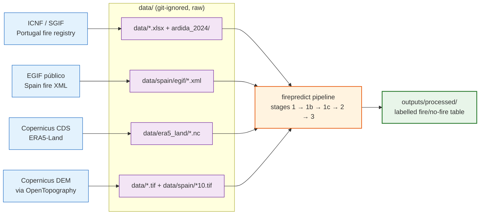

# Data sources

*Where to get every raw input — and exactly where to drop it on disk so the code finds it.*

[← README](../README.md) · [Pipeline](pipeline.md) · [Configuration](configuration.md) · [Output schema](output-schema.md) · [Adding a region](adding-a-region.md)

> The `firepredict` pipeline merges three raw sources — fire records, ERA5-Land weather
> reanalysis, and a terrain DEM — into one labelled table. This page tells you where to
> obtain each input and the exact path/glob the code expects, per region.

The active region is chosen by the `FIREPREDICT_REGION` environment variable. It defaults
to `portugal`; the other registered region is `spain`. Every path below is resolved
relative to the repository root by `firepredict/region.py` (the `RegionSpec` registry)
and `firepredict/config.py`.

```bash
# default region is portugal
.venv/bin/python -m firepredict.pipeline

# run a different region
FIREPREDICT_REGION=spain .venv/bin/python -m firepredict.pipeline
```

---

## At a glance — every input → expected path

All paths are relative to the repo root (`<repo>/data/...`). Globs are taken verbatim
from `firepredict/region.py`.

| Source | Region | Input | Expected path / glob |
| --- | --- | --- | --- |
| fire | Portugal | SGIF fire registry (Excel) | `data/Registos_Incendios_SGIF_*.xlsx` |
| fire | Portugal | ICNF burned-area shapefiles | `data/ardida_2024/ardida_*.shp` |
| fire | Spain | EGIF público fire records (XML) | `data/spain/egif/*.xml` |
| weather | both | ERA5-Land NetCDF chunks | `data/era5_land/<region>_<year>_<chunk:02d>_<group>.nc` |
| terrain | Portugal | Roughness raster | `data/viz.hh_roughness.tif` |
| terrain | Portugal | Slope raster | `data/viz.hh_slope.tif` |
| terrain | Portugal | Aspect raster | `data/viz.hh_aspect.tif` |
| terrain | Spain | Roughness raster | `data/spain/Roughness_spain10.tif` |
| terrain | Spain | Slope raster | `data/spain/Slope_spain10.tif` |
| terrain | Spain | Aspect raster | `data/spain/Aspect_spain10.tif` |

---

## Fire records

The fire registry supplies the positive (fire) events and their coordinates and times.
Stage 1 (`stage1_clean_fires`) dispatches to the per-region adapter in
`firepredict/fire_sources/` and writes the canonical `cleaned_fires.csv`.

### Portugal — SGIF + ICNF ardida

The Portugal adapter (`firepredict/fire_sources/portugal_sgif.py`) reads **two** inputs
and merges them:

| Input | Glob | Notes |
| --- | --- | --- |
| SGIF fire registry | `data/Registos_Incendios_SGIF_*.xlsx` | One or more Excel files; all matching files are concatenated. Provides cause and metadata columns. |
| ICNF burned-area shapefiles | `data/ardida_2024/ardida_*.shp` | Polygon geometries; the centroid becomes the fire `lat`/`lon`. Reprojected to EPSG:4326 on load. |

The shapefiles are the primary geometry source; SGIF rows whose `Cod_SGIF` is not already
present are appended as point fires. SGIF Excel column names are renamed to the canonical
(ICNF shapefile) names via `column_mapping` (e.g. `DataHoraAlerta → DH_Inicio`,
`TipoCausa → Causa_Tipo`, `Latitude → lat`, `Longitude → lon`).

Where to obtain it:

- Portugal wildfire statistics and registry data are published by **ICNF** (Instituto da
  Conservação da Natureza e das Florestas):
  <https://www.icnf.pt/florestas/gfr/gfrgestaoinformacao/estatisticas>
- The exact SGIF Excel export and the `ardida_*` burned-area shapefiles are derived from
  ICNF sources. Place the downloaded files at the paths above so the globs match.

> Adapter quirk: the Portugal loaders use **unsorted** `glob.glob` order on purpose, to
> keep `cleaned_fires.csv` byte-for-byte reproducible. Do not rename files in a way that
> changes their natural glob order.

### Spain — EGIF público (XML)

The Spain adapter (`firepredict/fire_sources/spain_egif.py`) parses **EGIF público** XML
exports — the *Estadística General de Incendios Forestales*, the Spanish government's
official forest-fire statistics. There is **no verified download URL to cite here**:
obtain the export from the official EGIF público source and verify the exact link
yourself. Do not trust a guessed URL.

| Input | Glob | Notes |
| --- | --- | --- |
| EGIF público records | `data/spain/egif/*.xml` | Plain `.xml` files (or `.zip` archives containing `.xml` members) are accepted. |

Expected XML format (from the adapter docstring). Root element is `<pifs>`, with one
`<Pif>` per fire. Each `<Pif>` has chapter children:

| Chapter | Fields read | Canonical mapping |
| --- | --- | --- |
| `pif_comun` | `<numeroparte>` (10-digit id), `<anio>` | `Cod_SGIF ← numeroparte` |
| `pif_localizacion` | `<latitud>`, `<longitud>` (WGS84 decimal degrees, west negative) | `lat`, `lon`; `geometry = Point(lon, lat)` EPSG:4326 |
| `pif_tiempos` | `<deteccion>`, `<controlado>`, `<extinguido>` (ISO local `YYYY-MM-DDThh:mm:ss`, Europe/Madrid, no offset) | `DH_Inicio ← deteccion`; `DH_Fim ← extinguido` (fallback `controlado`) |
| `pif_causa` | `<idcausa>` (numeric EGIF cause code) | `Causa_Tipo ← idcausa` (stored as-is, no cause filtering) |

Notes:

- Empty leaves are self-closed (e.g. `<extinguido />`) and parse to no value.
- Unlike Portugal (which stays timezone-naive), Spain timestamps are localized from
  Europe/Madrid to **UTC** by the adapter.
- Rows are dropped if `deteccion` is unparseable or coordinates fall outside the Spain
  bbox; records are de-duplicated on `Cod_SGIF`.
- EGIF público publishes through **2022**, so the Spain spec ends its year range at 2022.

---

## ERA5-Land weather (Copernicus CDS)

The primary weather backend is `era5` (`config.WEATHER_SOURCE = "era5"`), which reads
local **ERA5-Land** NetCDFs. Stage 2 (`stage2_add_weather`) joins them onto the fire
samples. The legacy `open_meteo` backend (`firepredict/weather.py` + `weather_bulk.py`,
Open-Meteo archive API: <https://open-meteo.com/en/docs/historical-weather-api>) remains
only as a fallback and is not the normal path.

### Where the files go

ERA5-Land NetCDFs live under `data/era5_land/`, one file per
**region × year × chunk × request group**, named by `config.era5_nc_path` /
`weather_era5`:

```
data/era5_land/<region>_<year>_<chunk:02d>_<group>.nc
```

- `<region>` is the active region key (`portugal` or `spain`).
- `<year>` is each year in the region's year range (Portugal 2014–2024; Spain 2014–2022).
- `<chunk>` is a zero-padded month chunk index (both regions use 1 month per chunk →
  chunks `01`..`12`).
- `<group>` is the CDS request-group name (the variable-grouping suffix). Portugal uses
  three mixed groups (`instant_a`, `instant_b`, `accum`); Spain uses 20 single-variable
  groups (`t2m`, `d2m`, `u10`, …) to stay under the CDS cost cap for its larger bbox.

### One-time CDS setup

ERA5-Land comes from the **Copernicus Climate Data Store (CDS)**. Set this up once per
machine before running `stage1c`:

1. Register a free account at the Copernicus CDS:
   <https://cds.climate.copernicus.eu/>
2. Create `~/.cdsapirc` with your API key — follow the CDS "how to api" page:
   <https://cds.climate.copernicus.eu/how-to-api>
3. Accept the ERA5-Land licence on the dataset page:
   <https://cds.climate.copernicus.eu/datasets/reanalysis-era5-land>

After that, the download stage works:

```bash
# default region (portugal)
.venv/bin/python -m firepredict.pipeline.stage1c_download_era5

# spain
FIREPREDICT_REGION=spain .venv/bin/python -m firepredict.pipeline.stage1c_download_era5
```

`stage1c` is **idempotent** — it skips any chunk file already present on disk, so it is
safe to re-run after an interruption.

> In practice the bulk, multi-year ERA5-Land downloads are run on a separate long-running
> **VM** (multi-GB, multi-hour CDS jobs), and the resulting NetCDFs are copied back into
> `data/era5_land/` here. `stage1c` still works locally with a valid `~/.cdsapirc`, but
> the VM is the normal path for a full regional pull (e.g. the Spain 2014–2022 set).

---

## Terrain (DEM-derived rasters)

Stage 3 (`stage3_add_terrain`) samples three terrain rasters at each fire/sample point.
The rasters are derived from a Digital Elevation Model. A good public DEM source is the
**Copernicus 30 m DEM** via OpenTopography:
<https://portal.opentopography.org/datasetMetadata?otCollectionID=OT.032021.4326.1>

> Historical note: the original methodology downscaled the Copernicus 30 m DEM to 10 m.
> Spain's products carry the `*10` suffix to reflect this. Earlier work also referenced
> land-use (COSc) and vegetation (MIAEV/IPMA) layers, but those are **not** used by this
> code pipeline.

### Portugal

| Raster | Expected path |
| --- | --- |
| Roughness | `data/viz.hh_roughness.tif` |
| Slope | `data/viz.hh_slope.tif` |
| Aspect | `data/viz.hh_aspect.tif` |

### Spain

Spain products must be named `Aspect_<region>10.tif`, `Roughness_<region>10.tif`,
`Slope_<region>10.tif` (here `<region>` is `spain`):

| Raster | Expected path |
| --- | --- |
| Roughness | `data/spain/Roughness_spain10.tif` |
| Slope | `data/spain/Slope_spain10.tif` |
| Aspect | `data/spain/Aspect_spain10.tif` |

Rasters may be in any CRS — `firepredict` reprojects sample points into each raster's CRS
when sampling, so you do not need to pre-reproject the TIFFs.

---

## The `data/` directory

`data/` holds raw, immutable inputs. It is **git-ignored and not redistributed** — none of
the files above ship with the repository. You must obtain each source yourself from the
links on this page (or, for Spain EGIF, from the official EGIF público source) and place
them at the documented paths. Only `outputs/` (fully reproducible) and `.cache/`
(transient) are generated by the pipeline.

### Sourcing map



> This repo creates the dataset only. Model training happens in a separate downstream
> project and is out of scope here.

---

**See also:** [Pipeline](pipeline.md) · [Configuration](configuration.md) · [Adding a region](adding-a-region.md)
