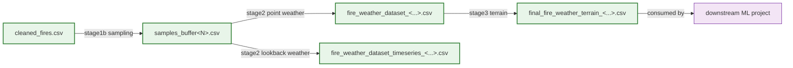

# Output schema

*Every CSV the pipeline writes, column by column.*

[← README](../README.md) · [Data sources](data-sources.md) · [Pipeline](pipeline.md) · [Configuration](configuration.md) · [Adding a region](adding-a-region.md)

> `firepredict` turns fire registries, weather, and terrain into one labelled,
> ML-ready CSV. This page documents the columns of each file along the way so you
> know exactly what each stage hands the next — and what the final dataset contains.

Every output lands under `outputs/processed/`. Filenames carry tokens (year,
buffer, region, `_bulk`) that are assembled in `config.py`; see
[Configuration](configuration.md) for how each token is derived. The examples below
use the **default `portugal`** filenames. For any other region a `_<key>` token is
inserted (e.g. `cleaned_fires_spain.csv`) — see `config.processed_path`.

## Row granularity

The unit of every weather/terrain row is **one `(cell, hour)` sample**: a single
0.1° ERA5-Land grid cell at a single floored UTC hour. A `label=1` row is a real fire
ignition; a `label=0` row is a synthetic non-fire moment drawn in a cell that *has*
burned at some point (case-control). The fire/no-fire ratio is set by
`NEG_SAMPLES_PER_POSITIVE` (default `10`, so ~10 negatives per positive). The exact
balance after rejection sampling may be slightly under that target — `stage1b` warns
rather than fails when hot cells can't yield enough negatives.

## File chain



> This repo produces the dataset only. Model training (the classifier that consumes
> `final_fire_weather_terrain_<...>.csv`) lives in a separate downstream project.

---

## 1. `cleaned_fires.csv`

Written by `stage1_clean_fires` — a thin dispatcher that runs the active region's
fire adapter, validates the canonical schema, and writes the result. One row per
deduped fire ignition, in EPSG:4326.

The adapter must produce **at least** the canonical columns
(`CANONICAL_FIRE_COLUMNS` in `firepredict/fire_sources/base.py`). Extra source
columns are allowed and **preserved** in the CSV — Portugal's `PortugalSgifAdapter`,
for example, carries through SGIF fields it picked up while joining the Excel
registry (such as `Cod_ANEPC`, `Causa_Cod`, `Causa_Desc`, `AreaHaSGIF`). The
canonical set is the only contract the rest of the pipeline depends on.

| Column | Type | Meaning |
| --- | --- | --- |
| `Cod_SGIF` | string | Fire record id (the dedupe key; for other regions it's the source's id column). |
| `DH_Inicio` | datetime | Ignition timestamp. Guaranteed non-null by `validate_canonical`. |
| `DH_Fim` | datetime | Extinction / end timestamp. May be null for fires of unknown duration. |
| `lat` | float | Latitude (EPSG:4326), from the geometry centroid. |
| `lon` | float | Longitude (EPSG:4326). |
| `Causa_Tipo` | string | Cause category (e.g. `Natural`). Used to pick positives downstream. |
| `geometry` | WKT | Fire geometry (point or burned-area polygon), serialized as WKT in the CSV. |
| *(extra)* | — | Any additional source columns the adapter preserved. |

---

## 2. `samples_buffer<N>.csv`

Written by `stage1b_generate_samples` via `sampling.build_samples_table`. `<N>` is the
negative-sampling buffer in days; stage 1b writes **one file per entry in
`NEG_BUFFER_DAYS_OPTIONS`** — by default `samples_buffer15.csv` and
`samples_buffer30.csv`. Downstream stages read whichever `ACTIVE_NEG_BUFFER_DAYS`
points at (default `15`); to compare settings, flip it and re-run stages 2→3.

This file is the union of fire positives (`label=1`) and synthetic negatives
(`label=0`). Negatives only fill the fire-only metadata columns with NA. A
`sample_id` is added as the first column.

| Column | Type | Meaning |
| --- | --- | --- |
| `sample_id` | int | Stable row id (0-based), assigned at concat time. |
| `label` | int | `1` = fire, `0` = negative. |
| `source` | string | `"fire"` for positives, `"negative"` for synthetic rows. |
| `Cod_SGIF` | string | Fire record id (NA for negatives). |
| `Causa_Tipo` | string | Cause category (NA for negatives). |
| `DH_Inicio` | datetime | Sample time — ignition time (positive) or drawn hour (negative). |
| `DH_Fim` | datetime | Fire end (NA for negatives). |
| `lat` | float | Latitude. For negatives this equals `snapped_lat` (sampled at cell center). |
| `lon` | float | Longitude. For negatives this equals `snapped_lon`. |
| `snapped_lat` | float | `lat` rounded to the `WEATHER_GRID_STEP` (0.1°) grid. The weather join key. |
| `snapped_lon` | float | `lon` rounded to the grid. |

Negatives are drawn only from cells that contain at least one real fire, and never
inside a fire's *forbidden window* `[DH_Inicio − halo, DH_Fim + halo]` (where
`halo = lookback_days + buffer_days`) — this prevents a negative's feature history
from touching an active fire. See `sampling.py` for the rejection-sampling detail.

---

## 3. `fire_weather_dataset_<...>.csv` — point weather

Written by `stage2_add_weather` (`write_point_weather`). Default Portugal name:
`fire_weather_dataset_<TARGET_YEAR>_bulk.csv` (e.g. `fire_weather_dataset_2024_bulk.csv`).
Every sample row from file 2, plus weather sampled **at the sample's floored UTC
hour** in its snapped cell.

The weather columns depend on `config.WEATHER_SOURCE`:

- **`open_meteo`** (legacy fallback) — exactly the four canonical columns below.
- **`era5`** (default) — the four canonical columns **plus** the extended ERA5-Land
  set. The column set is whatever `weather_era5.load_era5_dataset` produced from the
  NetCDFs on disk; a variable missing from a partial download is simply omitted.

Sample columns from file 2 are carried through verbatim, then:

### Canonical weather (both backends)

| Column | Unit | Source / derivation |
| --- | --- | --- |
| `temp` | °C | 2 m air temperature (ERA5 `2m_temperature`, K → °C). |
| `humidity` | % | Relative humidity via Magnus from temp + dewpoint. |
| `wind_speed` | km/h | √(u10² + v10²), m/s → km/h. |
| `precip` | mm/h | Total precipitation (ERA5 `total_precipitation`, m → mm). |

### Extended ERA5-Land set (only when `WEATHER_SOURCE=era5`)

Names and units are exactly those produced by `weather_era5.load_era5_dataset`.

| Column | Unit | ERA5-Land source variable |
| --- | --- | --- |
| `dewpoint` | °C | `2m_dewpoint_temperature` (K → °C). |
| `u10` | m/s | `10m_u_component_of_wind`. |
| `v10` | m/s | `10m_v_component_of_wind`. |
| `pressure` | hPa | `surface_pressure` (Pa → hPa). |
| `skin_temp` | °C | `skin_temperature` (K → °C). |
| `soil_temp_1` | °C | `soil_temperature_level_1` (0–7 cm). |
| `soil_moist_1` | m³/m³ | `volumetric_soil_water_layer_1` (0–7 cm). |
| `soil_moist_2` | m³/m³ | `volumetric_soil_water_layer_2` (7–28 cm). |
| `soil_moist_3` | m³/m³ | `volumetric_soil_water_layer_3` (28–100 cm). |
| `soil_moist_4` | m³/m³ | `volumetric_soil_water_layer_4` (100–289 cm). |
| `lai_low` | m²/m² | `leaf_area_index_low_vegetation`. |
| `lai_high` | m²/m² | `leaf_area_index_high_vegetation`. |
| `solar_net` | W/m² | `surface_net_solar_radiation` (J/m² ÷ 3600 s). |
| `thermal_net` | W/m² | `surface_net_thermal_radiation` (J/m² ÷ 3600 s). |
| `latent_heat` | W/m² | `surface_latent_heat_flux` (J/m² ÷ 3600 s). |
| `sensible_heat` | W/m² | `surface_sensible_heat_flux` (J/m² ÷ 3600 s). |
| `evap_total` | mm/h | `total_evaporation` (m → mm). |
| `evap_pot` | mm/h | `potential_evaporation` (m → mm). |

A sample whose hour falls outside the downloaded ERA5 coverage gets NaN weather
(the lookup returns NaNs rather than failing).

---

## 4. `fire_weather_dataset_timeseries_<...>.csv` — lookback weather

Written by `stage2_add_weather` (`write_timeseries_weather`) via
`weather_bulk.lookup_sequence`. Default Portugal name:
`fire_weather_dataset_timeseries_<TARGET_YEAR>_bulk.csv`.

Same sample rows as file 2, plus a **flattened lookback history**: for every weather
column `<col>` present in the cell table (the canonical four, plus the extended ERA5
set), one column per hour of history:

```
<col>_t-H   for H = lookback_hours, lookback_hours-1, ..., 1
```

`lookback_hours` defaults to `WEATHER_LOOKBACK_HOURS` = `24 × WEATHER_LOOKBACK_DAYS`
= **72** (3 days). So with the canonical four columns alone you get `temp_t-72 …
temp_t-1`, `humidity_t-72 … humidity_t-1`, `wind_speed_t-72 …`, `precip_t-72 …` — and
the same per-hour expansion for each extended ERA5 variable when present. If the full
window isn't available for a sample, all lookback columns for that row are NaN.

| Column group | Count | Meaning |
| --- | --- | --- |
| Sample columns | as file 2 | `sample_id`, `label`, `source`, ids, coords. |
| `<col>_t-H` | n_weather_cols × lookback_hours | Hourly history, oldest (`t-lookback`) to newest (`t-1`). |

This file is the input for sequence models (e.g. an RNN/GRU) in the downstream
project. The point-weather file (file 3) is the input for the flat tabular path.

---

## 5. `final_fire_weather_terrain_<...>.csv` — the ML dataset

Written by `stage3_add_terrain`. Default Portugal name:
`final_fire_weather_terrain_<TARGET_YEAR>_bulk.csv`. **This is the dataset for ML.**

It reads the **point-weather** file (file 3) — not the timeseries file — and samples
the active region's terrain rasters (`config.get_terrain_files()`) at each sample's
`(lon, lat)`, reprojecting points into each raster's CRS. So it contains every
column of file 3 plus the terrain block below.

| Column | Type | Meaning |
| --- | --- | --- |
| `roughness` | float | Terrain roughness, sampled from the roughness raster. |
| `slope` | float | Slope, sampled from the slope raster. |
| `aspect` | float | Aspect in degrees (0–360), sampled from the aspect raster. |
| `aspect_rad` | float | `aspect` in radians (`np.radians(aspect)`). |
| `aspect_sin` | float | `sin(aspect_rad)` — circular encoding. |
| `aspect_cos` | float | `cos(aspect_rad)` — circular encoding. |

Aspect is encoded as `sin`/`cos` so a model treats it as circular (359° and 1° are
close, not far apart). The raster filenames per region are listed in
[Data sources](data-sources.md); Portugal uses `data/viz.hh_roughness.tif`,
`viz.hh_slope.tif`, `viz.hh_aspect.tif`, and Spain expects
`Roughness_spain10.tif` / `Slope_spain10.tif` / `Aspect_spain10.tif`.

> Note: stage 3 attaches terrain to the **point-weather** rows only. If you need
> terrain alongside the flattened lookback history, join the timeseries file (file 4)
> to this one on `sample_id`.

---

**See also:** [Pipeline](pipeline.md) · [Configuration](configuration.md) · [Data sources](data-sources.md)
