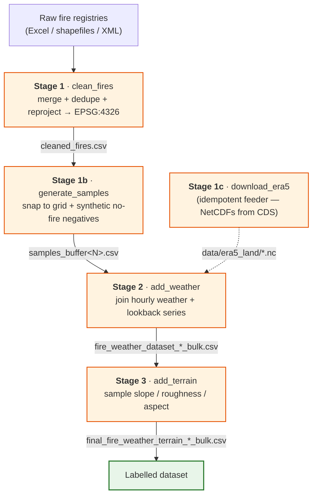

# The pipeline

*Five stages that turn raw fire records, weather, and terrain into one labelled CSV.*

[← README](../README.md) · [Data sources](data-sources.md) · [Configuration](configuration.md) · [Output schema](output-schema.md) · [Adding a region](adding-a-region.md)

> The pipeline is a strict linear chain of stages. Each stage reads the previous stage's CSV from `outputs/processed/`, does one job, and writes its own CSV. You can run the whole chain or any single stage — there is no hidden in-memory state between them.

---

## Flow



Stage 1c is a **side feeder** (dashed): it only downloads ERA5-Land NetCDFs into `data/era5_land/`. Stage 2 reads those files but does not depend on 1c running in the same invocation — in practice the NetCDFs are downloaded once and reused.

| Stage | Module | Reads | Writes |
|---|---|---|---|
| 1 | `stage1_clean_fires` | raw fire registries (per region) | `cleaned_fires.csv` |
| 1b | `stage1b_generate_samples` | `cleaned_fires.csv` | `samples_buffer15.csv`, `samples_buffer30.csv` |
| 1c | `stage1c_download_era5` | Copernicus CDS (network) | `data/era5_land/*.nc` |
| 2 | `stage2_add_weather` | `samples_buffer15.csv` + ERA5-Land NetCDFs | `fire_weather_dataset_<year>_bulk.csv`, `fire_weather_dataset_timeseries_<year>_bulk.csv` |
| 3 | `stage3_add_terrain` | `fire_weather_dataset_<year>_bulk.csv` + terrain TIFFs | `final_fire_weather_terrain_<year>_bulk.csv` |

`<year>` is the region's `label_year` (Portugal `2024`, Spain `2022`). Filenames carry a `_bulk` suffix to distinguish the current pipeline's outputs from older per-fire CSVs. For the full column listing of each output, see **[output-schema.md](output-schema.md)**.

---

## Running it

The repo ships its own venv (see the README quickstart: `python -m venv .venv && source .venv/bin/activate && pip install -e .`). The `-m` form is required so the package's relative imports resolve.

```bash
# Whole pipeline, all stages in order
python -m firepredict.pipeline

# Individual stages — re-run only what changed
python -m firepredict.pipeline.stage1_clean_fires
python -m firepredict.pipeline.stage1b_generate_samples
python -m firepredict.pipeline.stage1c_download_era5    # needs ~/.cdsapirc
python -m firepredict.pipeline.stage2_add_weather
python -m firepredict.pipeline.stage3_add_terrain

# A different region (default is portugal)
FIREPREDICT_REGION=spain python -m firepredict.pipeline
```

`firepredict/pipeline/__main__.py` runs the stages in order: stage 1 → 1b → 1c → 2 → 3, calling each module's `main()`. Every stage calls `config.ensure_output_dirs()` first, so the `outputs/` tree is created on demand.

> **Scope:** this repository stops at the labelled CSV. Training a model on it (XGBoost, a GRU, …) lives in a separate downstream project.

---

## Key idea: the strict linear CSV chain

Stages 2–3 (and 1b) depend only on the file on disk, never on an in-memory object from the previous stage. That has three practical consequences:

- **Run any prefix.** Stop after stage 1b to inspect the sample balance, then continue later.
- **Hand-edit a CSV and swap it in.** Drop a corrected `cleaned_fires.csv` into `outputs/processed/` and re-run from 1b — the upstream stage never has to re-run.
- **Re-run just the last stage.** Stage 3 is cheap; iterate on terrain extraction without recomputing weather.

`config.py` is the single source of truth for every path, glob, and constant. Stage modules never hard-code paths — they read `config.CLEANED_FIRES_CSV`, `config.SAMPLES_CSV`, `config.WEATHER_POINT_CSV`, etc. Retarget a year, region, or buffer by editing `config.py` (or setting `FIREPREDICT_REGION`) and the rest follows. See **[configuration.md](configuration.md)** for every knob.

---

## Stage 1 — clean fires

**Reads:** the active region's raw fire registries. **Writes:** `cleaned_fires.csv`.

Stage 1 is a thin dispatcher. It selects the fire-source adapter for `config.ACTIVE_SPEC`, runs `load_fires(spec)`, validates the canonical schema, and writes the result. The actual loading logic lives in per-country adapters under `firepredict/fire_sources/`.

**Portugal (`portugal_sgif`)** fuses two sources:

- ICNF burned-area shapefiles (`data/ardida_2024/ardida_*.shp`) — the geometric truth. Loaded, concatenated, reprojected to **EPSG:4326**, then `lat`/`lon` are taken from each polygon **centroid**.
- SGIF Excel registries (`data/Registos_Incendios_SGIF_*.xlsx`) — extra ignitions not present in the shapefiles. Renamed via the spec's `column_mapping` (e.g. `Codigo_SGIF → Cod_SGIF`, `DataHoraAlerta → DH_Inicio`, `Latitude → lat`) and appended only where `Cod_SGIF` is new.

Rows with a missing `DH_Inicio` are reconstructed from the SGIF `Ano/Mes/Dia/Hora` columns. The merged frame is deduped by `Cod_SGIF` and dropped of rows without a timestamp or cause.

**Spain (`egif`)** parses EGIF público XML (`data/spain/egif/*.xml`): one `<Pif>` per fire, with `numeroparte → Cod_SGIF`, `deteccion → DH_Inicio`, `extinguido` (fallback `controlado`) `→ DH_Fim`, `latitud`/`longitud → lat`/`lon`, `idcausa → Causa_Tipo`, geometry `Point(lon, lat)`. Spain timestamps are localized from `Europe/Madrid` to UTC; Portugal stays tz-naive on purpose.

The canonical column names are the shapefile's (`Cod_SGIF`, `DH_Inicio`, `DH_Fim`, `Causa_Tipo`, `lat`, `lon`, …). These are what every downstream stage expects.

---

## Stage 1b — generate samples

**Reads:** `cleaned_fires.csv`. **Writes:** one `samples_buffer<N>.csv` per entry in `config.NEG_BUFFER_DAYS_OPTIONS` (default `(15, 30)`).

This stage turns positives-only fire records into a labelled training table by adding synthetic non-fire rows. It first snaps every fire to the ERA5 grid, then for each buffer setting calls `build_samples_table(...)` to produce positives (`label=1`) merged with synthetic negatives (`label=0`). Each row gets a `sample_id`, a `source` (`fire` / `negative`), `DH_Inicio`, `lat`/`lon`, and `snapped_lat`/`snapped_lon`. Timestamps are written in a fixed ISO format (`%Y-%m-%dT%H:%M:%S`) so downstream readers don't mis-infer the format from the first row.

Downstream stages read whichever file `config.ACTIVE_NEG_BUFFER_DAYS` (default `15`) points at, via `config.SAMPLES_CSV`. Generating both `samples_buffer15.csv` and `samples_buffer30.csv` lets the downstream model be trained and compared on each — flip `ACTIVE_NEG_BUFFER_DAYS` and re-run stages 2→3; stage 1b need not re-run.

### Grid snapping (~11 km ERA5 grid)

Negative sampling and weather joins both operate on **grid cells**, not raw coordinates. `weather_bulk.snap_to_grid(lat, lon)` rounds a point to the nearest multiple of `config.WEATHER_GRID_STEP` (default `0.1°`, ~11 km), and rounds the result to a stable number of decimals so float drift can't break the cell key (otherwise `40.1` could surface as `40.099999999999994`).

`0.1°` matches ERA5-Land's native resolution exactly, so every snapped fire cell lands on a real ERA5-Land grid point — no oversampling on either side. Snapping also collapses many fires in the same cell into a single weather lookup.

### Negative sampling: case-control + the forbidden window

Negatives are drawn **case-control**, defined in `firepredict/sampling.py`:

1. **Cell pool.** Only snapped cells that contain at least one real fire are eligible. Cells that have never burned are excluded — they are trivially negative and would teach the classifier "does this cell ever burn?" instead of "*when* will it burn?".
2. **Forbidden window.** For every fire in a cell, the window

   ```
   [DH_Inicio − (lookback + buffer),  DH_Fim + (lookback + buffer)]
   ```

   is off-limits for negatives in that cell, where `lookback = config.WEATHER_LOOKBACK_DAYS` (default `3`) and `buffer` is the stage's `buffer_days`. The `lookback` term prevents a negative's feature history from intersecting an active fire (a data leak). The `buffer` is an extra safety margin, because the weather right before a fire contributes to ignition — labelling that moment "no fire" would teach the model the opposite of what we want. Missing `DH_Fim` is filled with `DH_Inicio + 1 day`. Per-cell windows are merged into non-overlapping intervals for fast rejection.
3. **Sampling.** For each positive, draw `config.NEG_SAMPLES_PER_POSITIVE` (default `10`) uniform random `(cell, hour)` pairs from the pool × the observed time range. Reject any draw inside that cell's forbidden windows, dedupe collisions, and warn (never crash) if hot cells with a large buffer can't supply the requested count. Sampling is seeded by `config.SAMPLE_RANDOM_SEED` (default `42`) for reproducibility.

A larger buffer is safer against leakage but squeezes hot cells harder; a smaller buffer yields more data but risks leaking fire-weather into negatives. That trade-off is exactly why both buffer files are produced.

---

## Stage 1c — download ERA5-Land (side feeder)

**Reads:** Copernicus CDS over the network. **Writes:** `data/era5_land/<region>_<year>_<chunk>_<group>.nc`.

Stage 1c fetches ERA5-Land reanalysis NetCDFs for the active region's bbox and years (`config.ERA5_YEARS`). Each year is split into monthly chunks (`config.ERA5_MONTHS_PER_CHUNK`), and each chunk into request groups (`config.ERA5_REQUEST_GROUPS`) so every CDS request stays under the per-request cost cap. Portugal uses three mixed groups (`instant_a`, `instant_b`, `accum`); Spain uses 20 single-variable groups because its bbox is ~4.5× larger. The stage is **idempotent** — component files already on disk are skipped, so it is safe to re-run after a failure.

Setup is required once per machine:

1. Register a free account at the [Copernicus Climate Data Store](https://cds.climate.copernicus.eu/).
2. Put your API key in `~/.cdsapirc` (see the [CDS "how to API" guide](https://cds.climate.copernicus.eu/how-to-api)).
3. Accept the licence on the [ERA5-Land dataset page](https://cds.climate.copernicus.eu/datasets/reanalysis-era5-land).

In practice the multi-GB, multi-year pulls take hours and are run **once** (often on a separate long-running machine); the resulting NetCDFs are copied into `data/era5_land/` and reused. `stage1c` runs locally with a valid `~/.cdsapirc`, but it is the exception, not the normal path. See **[data-sources.md](data-sources.md)**.

---

## Stage 2 — add weather

**Reads:** `config.SAMPLES_CSV` (the active `samples_buffer<N>.csv`) + the weather backend. **Writes:** two CSVs:

- `fire_weather_dataset_<year>_bulk.csv` — sample columns + **point weather** at each sample's hour.
- `fire_weather_dataset_timeseries_<year>_bulk.csv` — the same rows plus the flattened **lookback time-series**.

Stage 1b already attached `snapped_lat`/`snapped_lon`, so no re-snapping happens here. The stage builds a per-cell weather table (`{ (snapped_lat, snapped_lon): hourly DataFrame }`), then for every sample:

- **Point weather** (`lookup_point`): the hourly row at the sample's UTC-floored hour.
- **Lookback series** (`lookup_sequence`): the `config.WEATHER_LOOKBACK_HOURS` (default `72`, i.e. 3 days) hours *preceding* the sample, flattened into `<col>_t-H` columns for `H = lookback, …, 1`.

All fire times are floored to the hour and UTC-localized before lookup. Break that contract and cache/grid joins silently miss.

### The lookback time-series (for sequence models)

The point CSV is a flat feature table; the time-series CSV is the same rows widened with one column per `(variable, hour-offset)`. For the canonical four weather variables that means `temp_t-72 … temp_t-1`, `humidity_t-*`, `wind_speed_t-*`, `precip_t-*` (plus the extended ERA5 variables when present). This is meant to feed sequence models (e.g. a GRU) downstream that consume the preceding window as an ordered series. A sample whose full lookback window isn't available gets all-NaN for the series columns.

### Two weather backends, and why ERA5-Land is primary

`config.WEATHER_SOURCE` selects the backend:

| Backend | Module | Source | Notes |
|---|---|---|---|
| `era5` (default) | `weather_era5.py` | local ERA5-Land NetCDFs (`data/era5_land/`) | Primary. No network, no rate limit. Exposes the canonical four vars plus an extended fire-relevant set (dewpoint, wind components, pressure, skin/soil temperature, soil moisture, LAI, radiation/heat fluxes, evaporation). |
| `open_meteo` | `weather.py` + `weather_bulk.py` | Open-Meteo archive API | Legacy fallback. Rate-limited on the free tier (sleeps ~70 s on a minutely-limit hit, throttles between calls). Cached at `.cache/openmeteo.sqlite`. |

ERA5-Land is primary because it is the same underlying reanalysis Open-Meteo re-serves, but read directly from local files: no rate limit, no network dependency in the per-sample loop, and access to the full 20-variable fire-relevant set rather than the four the Open-Meteo path produces. Both backends produce the same per-cell table shape, so `lookup_point` / `lookup_sequence` work unchanged either way.

The ERA5 loader does **not** eager-load all 20 variables (that OOM'd at ~8 GB). It loads variables in small groups (`var_chunk_size`, default `4`), extracts every cell's time slice for that group, joins into the result, and frees the group before the next — bounding peak memory while keeping per-cell `.sel` cheap. The canonical units are normalized on load: `temp` °C, `humidity` % (Magnus formula from temperature + dewpoint), `wind_speed` km/h (from the 10 m wind components), `precip` mm/h.

> **ns vs µs datetimes.** CSV-loaded `datetime64[us]` mixed with ns silently under-reports forbidden-window coverage by 1000×; `sampling._to_int64_ns` forces ns resolution. Don't reintroduce this by `.astype('int64')` on a µs datetime.

---

## Stage 3 — add terrain

**Reads:** `fire_weather_dataset_<year>_bulk.csv` + the region's terrain TIFFs. **Writes:** `final_fire_weather_terrain_<year>_bulk.csv` — the final labelled dataset.

Stage 3 rebuilds point geometries from `lon`/`lat` (EPSG:4326) and samples each terrain raster from `config.get_terrain_files()` at every point. For Portugal those are `data/viz.hh_roughness.tif`, `data/viz.hh_slope.tif`, `data/viz.hh_aspect.tif`; for Spain `data/spain/Roughness_spain10.tif`, `Slope_spain10.tif`, `Aspect_spain10.tif`. (Terrain products derive from the Copernicus 30 m DEM, downscaled to 10 m, and must be named `Aspect_<region>10.tif`, `Roughness_<region>10.tif`, `Slope_<region>10.tif`. See [Copernicus DEM via OpenTopography](https://portal.opentopography.org/datasetMetadata?otCollectionID=OT.032021.4326.1).)

`rasters.sample_raster()` reprojects the points **into each raster's CRS** before sampling and maps the raster's NoData sentinel to `NaN` — so you never sample in the wrong projection. Aspect (0–360°) is also encoded as `aspect_sin` / `aspect_cos` so models can treat it as a circular quantity (0° and 360° are the same direction). The geometry column is dropped and the table written as the final CSV.

For the complete column list of this file — labels, identifiers, weather, lookback series, and terrain — see **[output-schema.md](output-schema.md)**.

---

**See also:** [Data sources](data-sources.md) · [Configuration](configuration.md) · [Output schema](output-schema.md)
